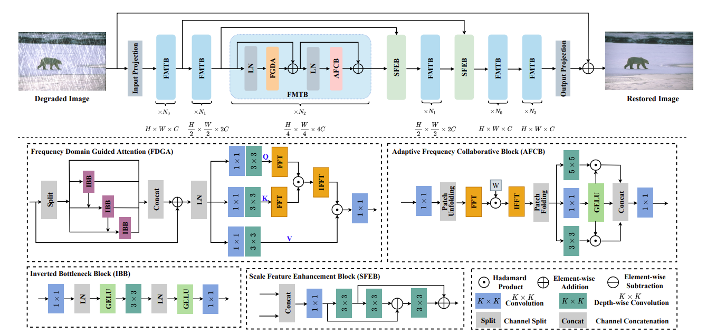

# Exploring An Efficient Frequency-Guidance Transformer for Single Image Deraining
<!---
[](https://drive.google.com/drive/folders/1KRR_L276nviPT9JFPL9zfBiZVKJO6dM1?usp=drive_link)
[](https://pan.baidu.com/s/1TlgoslD-hIzySDL8l6gekw?pwd=pu2t)
--->

> **Abstract:** 
In this paper, we propose an Efficient Frequency-Guided image deraining transformer, called EFGformer, to explore the more useful self-attention values from the frequency domain for better image deraining. Inspired by the traditional convolution theorem, we design frequency domain guidance attention (FDGA) to learn rich global and local dependencies. Firstly, we employ affine coupling to increase receptive fields implicitly, enabling the capturing of multi-scale spatial feature representations, and then they are transferred to the frequency domain using the Fourier transform. Instead of using vanilla attention, we adopt element-wise product to model global frequency information for better feature aggregation and reducing computational complexity. As traditional feed-forward networks struggle with frequency information, we introduce an adaptive frequency collaborative block (AFCB) to adaptively learn frequency information and integrate local spatial information for improved image restoration. Moreover, a scale feature enhancement block (SFEB) is designed to exchange and aggregate information at different scales for learning mixed features of various scales. Extensive experimental results on commonly used benchmark datasets demonstrate that our method outperforms competitive methods in terms of both performance and computational overhead. The source codes are available at https://github.com/MingTian99/EFGformer.



## News

- **Oct 20, 2023:** Paper submitted. 
- **Oct 20, 2023:** The basic version is released, including codes, pre-trained models on the Rain200H dataset, and the used dataset.
<!---  ** Sep 15, 2023:** The [visual results on Sate 1K](https://pan.baidu.com/s/1dToHnHI9GVaHQ3-I6OIbpA?pwd=rs1k) and [real-world dataset RSSD300](https://pan.baidu.com/s/1OZUWj8eo6EmP5Rh8DE1mrA?pwd=8ad5) are updated.-->


## Preparation

## Datasets
<table>
<thead>
  <tr>
    <th>Dataset</th>
    <th>Rain200H</th>
    <th>Rain200L</th>
    <th>Rain800</th>
    <th>Rain1400</th>
  </tr>
</thead>
<tbody>
  <tr>
    <td>Baidu Cloud</td>
    <td> <a href="https://pan.baidu.com/s/1SR7yULy0VZ_JZ4Vawqs7gg#list/path=%2F">Download</a> </td>
    <td align="center"> <a href="https://pan.baidu.com/s/1SR7yULy0VZ_JZ4Vawqs7gg#list/path=%2F">Download</a> </td>
    <td> <a href="https://pan.baidu.com/s/1Hvm9ctniC7PMQdKrI_lf3Q">Download</a> </td>
    <td> <a href="https://pan.baidu.com/s/1Hvm9ctniC7PMQdKrI_lf3Q">Download</a> </td>
  </tr>
</tbody>
</table>
Here, the ''Rain200H'', ''Rain200L'', ''Rain800'' and ''Rain1400'' are provide. 
<!---
## Pre-trained Models
<table>
<thead>
  <tr>
    <th>Dataset</th>
    <th>Thin Haze</th>
    <th>Moderate Haze</th>
    <th>Thick Haze</th>
    <th>RICE</th>
  </tr>
</thead>
<tbody>
  <tr>
    <td>Baidu Cloud</td>
    <td> <a href="https://pan.baidu.com/s/1ncoc2qnlZd5hkSak6jEvrw?pwd=0nvo">Download</a> </td>
    <td align="center"> <a href="https://pan.baidu.com/s/1ncoc2qnlZd5hkSak6jEvrw?pwd=0nvo">Download</a> </td>
    <td > <a href="https://pan.baidu.com/s/1ncoc2qnlZd5hkSak6jEvrw?pwd=0nvo">Download</a> </td>
    <td> <a href="https://pan.baidu.com/s/1OWtEGwccqzf6cmCtDhWZnA?pwd=gj56">Download</a> </td>
  </tr>
</tbody>
<tbody>
  <tr>
    <td>Google Drive</td>
    <td> <a href="https://drive.google.com/drive/folders/1Dbja877w0TWXDqw9WYVwnRQMl6V9DkaT?usp=drive_link">Download</a> </td>
    <td align="center"> <a href="https://drive.google.com/drive/folders/1Dbja877w0TWXDqw9WYVwnRQMl6V9DkaT?usp=drive_link">Download</a> </td>
    <td> <a href="https://drive.google.com/drive/folders/1Dbja877w0TWXDqw9WYVwnRQMl6V9DkaT?usp=drive_link">Download</a> </td>
    <td> <a href="https://drive.google.com/drive/folders/1-d4OrxIbN3sN5coywpAvQavFIpQKxQwN?usp=drive_link">Download</a> </td>
  </tr>
</tbody>
</table>
Currently, we only provide the pre-trained models trained on the Sate 1K dataset. The pre-trained model of the RICE dataset will be updated as quickly as soon.
--->

### Install

We test the code on PyTorch 1.9.1 + CUDA 11.1 + cuDNN 8.0.5.

1. Create a new conda environment
```
conda create -n EFGformer python=3.8
conda activate EFGformer 
```

2. Install dependencies
```
pip install torch==1.9.1+cu111 torchvision==0.10.1+cu111 torchaudio==0.9.1 -f https://download.pytorch.org/whl/torch_stable.html

pip install matplotlib scikit-image opencv-python numpy einops math natsort tqdm lpips time tensorboardX
```

### Download

You can download the pre-trained models and datasets on Google Drive or BaiduPan.

Currently, we only provide the pre-trained model trained on the Sate 1K dataset and the used dataset (Sate 1K, RICE and RRSD300).  

The pre-trained models trained on RICE will be updated as quickly as possible.

The final file path should be the same as the following:

```
┬─ pretrained_models
│   ├─ Rain200H.pth
│   ├─ Rain200L.pth
│   ├─ ... (model name)
│   └─ ... (exp name)
└─ data
    ├─ Datas
    │├─ Rain200H
    ││   ├─ train
    ││   │   ├─ input
    ││   │   │   └─ ... (image filename)
    ││   │   └─ target
    ││   │       └─ ... (corresponds to the former)
    ││   └─ test
    ││       └─ ...
    │└────  ... (dataset name)
    │
    │
    └─ ... (dataset name)

```
### Training, Testing and Evaluation

### Train
The training code will be released after the paper is accepted.
You should change the path to yours in the `Train.py` file.  Then run the following script to test the trained model:

```sh
python Train.py
```

### Test
You should change the path to yours in the `Test.py` file.  Then run the following script to test the trained model:

```sh
python Test.py
```

<!---
### Evaluation
You should change the path to yours in the `DerainDataset.py` file.  Then run the following script to test the trained model:

```sh
python PSNR_SSIM.py
```
It is recommended that you can download the visual deraining results and retest the quantitative results on your own device and environment.
--->

<!---
### Visual Results

<table>
<thead>
  <tr>
    <th>Dataset</th>
    <th>Thin Haze</th>
    <th>Moderate Haze</th>
    <th>Thin Haze</th>
  </tr>
</thead>
<tbody>
  <tr>
    <td>Baidu Cloud</td>
    <td> <a href="https://pan.baidu.com/s/1dToHnHI9GVaHQ3-I6OIbpA?pwd=rs1k">Download</a> </td>
    <td align="center"> <a href="https://pan.baidu.com/s/1dToHnHI9GVaHQ3-I6OIbpA?pwd=rs1k">Download</a> </td>
    <td> <a href="https://pan.baidu.com/s/1dToHnHI9GVaHQ3-I6OIbpA?pwd=rs1k">Download</a> </td>
  </tr>
</tbody>
<tbody>
  <tr>
    <td>Google Drive</td>
    <td> <a href="https://drive.google.com/drive/folders/16UHn439SMJp0ZnDt_yoYc96ypsY7FN7n?usp=drive_link">Download</a> </td>
    <td align="center"> <a href="https://drive.google.com/drive/folders/16UHn439SMJp0ZnDt_yoYc96ypsY7FN7n?usp=drive_link">Download</a> </td>
    <td> <a href="https://drive.google.com/drive/folders/16UHn439SMJp0ZnDt_yoYc96ypsY7FN7n?usp=drive_link">Download</a> </td>
  </tr>
</tbody>
</table>
Currently, we provide the visual results on the Sate 1K dataset. The visual results of the RICE dataset and RSSD300 will be updated as quickly as soon.
--->

## Notes

1. Send e-mail to songtienyu@163.com if you have critical issues to be addressed.
2. Please note that there exists the slight gap in the final version due to errors caused by different testing devices and environments. 
3. Because the synthetic dataset is not realistic enough, the trained models may not work well on real hazy images.


## Acknowledgment

This code is based on the [Restormer](https://github.com/swz30/Restormer). 
